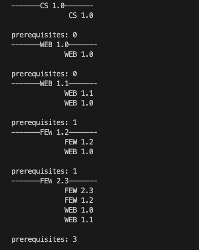

# CS1-2-Graph-Project

### Course Scheduler

Credit for the inspiration of this project goes to Sergey Karayev from Gradescope

#### Description

It’s hard coming up with a course schedule for your full-tenure at Make School! You’ve got all these requirements to satisfy before graduating, and you have to take certain courses in a particular order due to prerequisites. Doing this manually could be incredibly frustrating, and also doesn’t scale (what if MS adds another track? Or another 3?).

In this project, you will solve this manual headache by creating a system that can do this for any track for any number of courses! To do this, there are 3 parts of this project to complete:

- Create a graph data structure. First you must build a graph data structure that supports nodes and directed edges. Nodes will have data associated with them, and can have 0-infinite edges. Edges will be directed, meaning they can only be traveled in one direction
- Create a directed graph based on a JSON file: given a JSON file of course names and prerequisites, generates a graph where prerequisites are connected by directed edges.
- Write a function that given a graph and a course name, finds how many prerequisites it has. This will be done by traversing the graph!
- Stretch Challenge (Optional): given a JSON file of course names and prerequisites,generate a schedule by printing the names of courses in a prerequisite-satisfying order.
